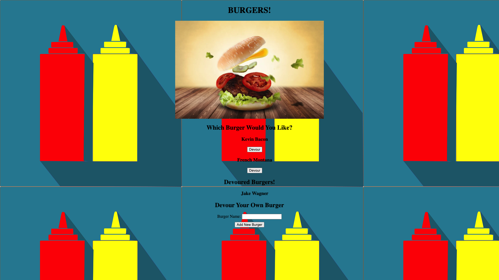

# HW-11-nodeExpressHandlebars
# For Burgers!

## Table of Contents
* Description
* Active URLS
* Installation Instructions
* Screenshot
* Additional Questions 

## Description
This is an application for a creative DIY burger restaurant. Each customer can come up with their own burger and add it to a database for others to see. When the user types in the name of their new burger, they will submit the name using a button and then the name of their burger will display on the page. 

Once a customer has devoured a burger from the list, they should be able to log that to the database! So, after each burger smashing the user can press the `Devour` button next to the name of the burger they just slammed. 

Don't worry about losing the data from your crushed burgers! All data will be saved in the database regardless of if you have devoured the burger or not.

## Active URLS
[Github Repository](https://github.com/jkwagneriii/HW-11-nodeExpressHandlebars)

[Live Heroku Application](https://fierce-reaches-68356.herokuapp.com/)

## Installation Instructions
In the same directory as package.json, type ```npm install```

## Screenshot


## Additional Questions
If you have any questions about the project or would like to contact me, please reach out through GitHub.

[Jake Wagner on GitHub](https://github.com/jkwagneriii)
